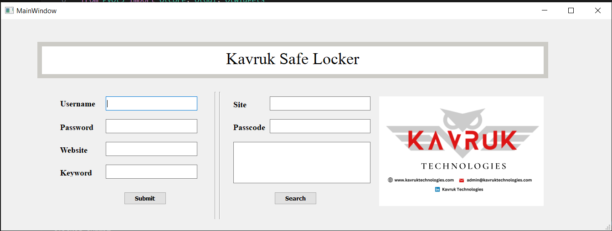
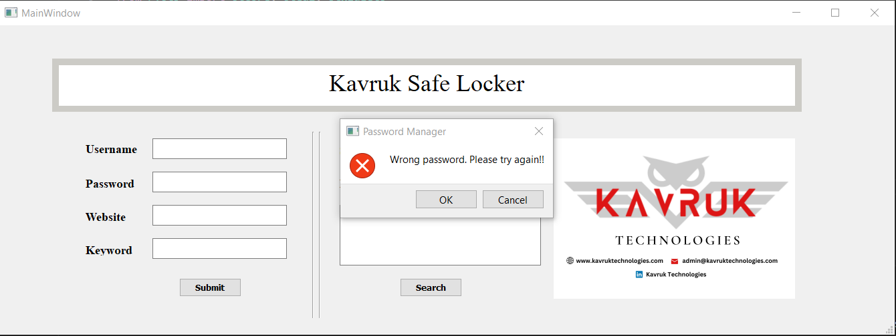

# Password Management Page by Kavruk


## Introduction

Welcome to the **Password Management Page** project, created by Kavruk. This project is a simple password management application built using Python, PyQt5 (a Python library for creating graphical user interfaces), and a DBMS (Database Management System). The purpose of this application is to help users securely store and manage their passwords.

To run the project, you need to execute the `password.py` file, which is the main Python script of the application. This file contains the code responsible for launching the graphical user interface and interacting with the database.

## Features

- Securely store and manage your passwords.
- User-friendly graphical user interface.
- Support for adding, updating, and deleting passwords.
- Encrypted storage of passwords in the database.
- Easy-to-use interface for quick access to stored passwords.

## Prerequisites

Before you can run the project, make sure you have the following dependencies installed:

- Python: Make sure you have Python installed on your system. You can download it from the official website: [Python Downloads](https://www.python.org/downloads/)

- PyQt5: Install PyQt5 library using pip:

  ```bash
  pip install PyQt5
  ```

- Database Management System: The project uses a DBMS to store passwords. SQLite is used by default, which comes with Python by default.

## How to Run

1. Clone this GitHub repository to your local machine or download it as a ZIP file.

2. Navigate to the project directory using your terminal or command prompt.

3. Run the following command to start the application:

   ```bash
   python password.py
   ```

4. The Password Management Page application will open up. You can now start managing your passwords securely.

## Usage

1. Launch the application using the steps mentioned above.

2. Use the interface to add, update, or delete passwords.

3. Your passwords will be stored securely in the database.

## Screenshots




## License

This project is licensed under the [MIT License](LICENSE).

## Acknowledgments

We would like to express our gratitude to the developers and contributors of the following libraries and tools that were used in the creation of this project:

- Python: [Python](https://www.python.org/)
- PyQt5: [PyQt5](https://pypi.org/project/PyQt5/)
- SQLite: [SQLite](https://www.sqlite.org/)

## Contact

If you have any questions, suggestions, or issues, please feel free to contact::

- Name: Shubham Kothawade
- GitHub: [GitHub Profile](https://github.com/shubhamkothawade24)
- https://www.kavruktechnologies.com/

Thank you for using the Password Management Page by Kavruk Technologies!
